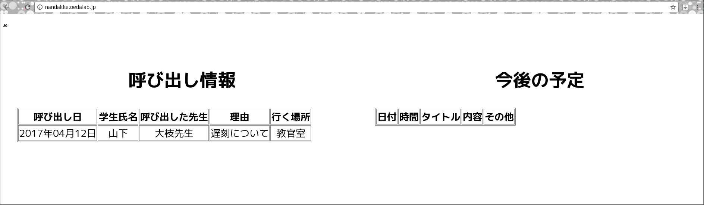
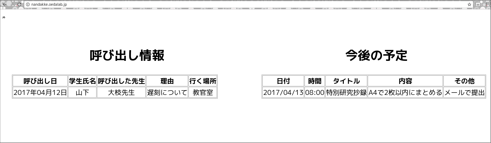

# nandakkeマニュアル 先生用

<h2>http://nandakke.oedalab.jp/</h2>

- username : J[学年]-teacher
- passward : J[学年]-teacher

(例)

- username : J2-teacher
- passward : J2-teacher

passwardは変更して下さい．また，学生にもパスワードの変更をさせるようアナウンスをお願いします．

## 機能
- 編集できる学生の権限の変更
- 学生呼び出し編集
- 課題等スケジュール編集
- パスワード，学年の変更

各機能は， http://nandakke.oedalab.jp/admin からアクセスできます．

## 学生の権限の変更

学生権限管理画面で，編集者にしたい学生の学籍番号の右隣にある[member▼]をクリックし，[editor]を選択して下さい．

その後，ページ最下部にある[変更]ボタンをクリックし，変更を確定させて下さい．

 

## 学生呼び出し

呼び出し一覧ページで， <u>New Summons</u> をクリックします．

New Summonsページで，
- 呼び出す学生氏名
- 呼び出した先生
- 呼び出された理由
- 学生が行く場所

を記入し，[Create Summons]ボタンをクリックします．

掲示板画面に，呼び出し情報が追加されます．
 
 
 
 
 
 

## スケジュール管理

予定一覧ページで， <u>New Schedule</u> をクリックします．

New Scheduleページで，
- 締め切り日
- 締め切り時間
- タイトル
- 内容
- その他(提出方法など)

を記入し，[Create Schedule]ボタンをクリックします．

掲示板画面に，スケジュールが追加されます．

 

## パスワード，学年の変更

Username は変更できません．

### パスワードの変更
PasswardとPassward confirmationのテキストボックスに新しく設定するパスワードを入力して下さい．

Current passwardのテキストボックスに，現在のパスワードを入力して下さい．

[Update]ボタンをクリックすると，パスワードが更新されます．

### 学年の変更
class [J* ▼]をクリックし，自分の現在の学年を選択して下さい．

Current passwardのテキストボックスに，現在のパスワードを入力して下さい．

[Update]ボタンをクリックすると，学年が更新されます．
